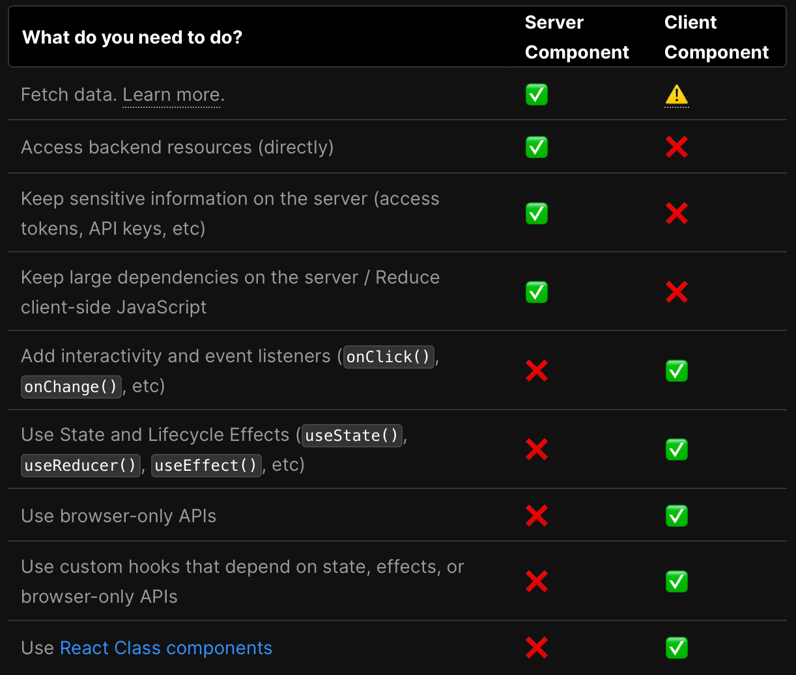

### Icons

```sh
npm i react-icons
```

```js
import { MdSearch } from 'react-icons/md';
```

### Styling. CSS modules

```js
<span className={`${styles.status} ${styles.pending}`}>Pending</span>
```

### Router and Navigation

`1`. /app/dashboard ==> http://localhost:3000/dashboard

### Custom layout

`1`. Dashboard layout - /app/dashboard/layout.tsx ==> http://localhost:3000/dashboard
`2`. Dashboard page - /app/dashboard/page.tsx ==> http://localhost:3000/dashboard

### Link

```js
<Link href={`/dashboard/products/${product.id}`}>
  <button className={`${styles.button} ${styles.view}`}>View</button>
</Link>
```

### HOOK. useSearchParams. Search params in Next.js

> page.tsx file props-ooroo 'searchParams', 'params' 2-iig optional-oor awdag.

```js
// Parent Component. Server Side Rendering
const UsersPage = async ({ searchParams }: ISearchParams) => {
  const q = searchParams?.q || '';
  const page = searchParams?.page || 1;
  const { count, users } = await fetchUsers(q, page);

  return (
   <div className={styles.top}>
        <Search placeholder='Search for a user...' />
        <Link href='/dashboard/users/add'>
          <button className={styles.addButton}>Add New</button>
        </Link>
  </div>
)

// Child Component. Client Side Rendering
import { usePathname, useRouter, useSearchParams } from 'next/navigation';

const Search = ({ placeholder }: SearchPropsType) => {
  const searchParams = useSearchParams();
  const { replace } = useRouter();
  const pathname = usePathname();

    return // Components...
}

let url = new URL('https://example.com?foo=1&bar=2');
let params = new URLSearchParams(url.search);

// Add a third parameter.
params.set('baz', 3);
params.toString(); // "foo=1&bar=2&baz=3"
```

### Use Client

```js
'use client';

import styles from './pagination.module.css';
import { usePathname, useRouter, useSearchParams } from 'next/navigation';
```



### useDebouncedCallback.

> it prevents frequent updates caused by rapid input changes or repeated events, allowing for smoother interactions and reduced resource consumption.

```js
import { useDebouncedCallback } from 'use-debounce';

const handleSearch = useDebouncedCallback((e) => {
  const searchInput = e.target.value;
  const params = new URLSearchParams(searchParams);

  params.set('page', '1'); // '/dashboard/users' ==> '/dashboard/users?page=1'

  if (searchInput) {
    searchInput.length > 2 && params.set('q', searchInput); // '/dashboard/users?page=1' ==> '/dashboard/users?page=1&q=admin'
  } else {
    params.delete('q');
  }
  replace(`${pathname}?${params}`);
}, 300);
```
